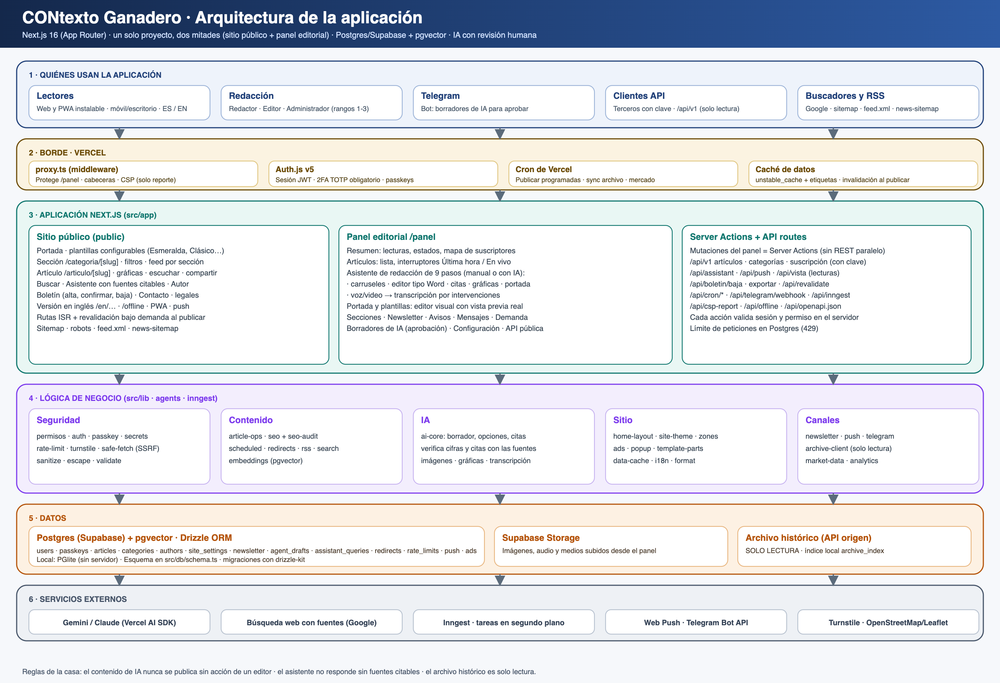

# Arquitectura — monolito modular

CONtexto Ganadero es **un monolito modular**: se despliega como una sola aplicación Next.js sobre una sola base de
datos, pero su código está dividido en **módulos de dominio independientes** con dependencias dirigidas y verificadas
por herramienta. El objetivo es el de una arquitectura de microservicios (límites claros, cambios locales, piezas
sustituibles) sin su coste operativo (red, despliegues múltiples, consistencia distribuida).



## 1. Principios
1. **Un módulo, una responsabilidad de negocio.** Cada módulo es dueño de su lógica y de sus tablas.
2. **Dependencias hacia abajo, nunca en círculo.** El grafo permitido está en `scripts/modulos.config.json` (`puedeUsar`).
3. **Lo que ocurre en un módulo se anuncia; no se invoca.** Las reacciones entre módulos van por eventos (`src/lib/eventos.ts`).
4. **La interfaz es el contrato.** Se importa un módulo por su fachada (p. ej. `@/lib/ai-core`), no por sus archivos internos.
5. **La arquitectura se hace cumplir sola:** `npm run lint` ejecuta `scripts/check-modulos.mjs`; en CI una dependencia nueva fuera del grafo rompe el build.

## 2. Mapa de módulos y dependencias permitidas
| Módulo | Responsabilidad | Puede usar |
|---|---|---|
| **infra** | Base de datos (esquema/cliente), caché, límites de uso, SSRF, utilidades, modelo de diseño y piezas de UI comunes | — |
| **acceso** | Usuarios, sesiones, 2FA, passkeys, permisos y roles | infra |
| **archivo** | Archivo histórico (solo lectura) | infra |
| **contenido** | Notas, secciones, autores, SEO, búsqueda, programación, redirecciones | infra, acceso |
| **ia** | Borrador, opciones, gráficas, ideas, noticias, portada, transcripción, verificación de cifras y citas | infra, acceso, contenido, archivo, analitica |
| **portada-tema** | Plantillas, portada, tema, anuncios, ventana emergente, cabecera y pie del sitio | infra, acceso, contenido |
| **newsletter** | Suscripción, ediciones y envío del boletín | infra, acceso, contenido, portada-tema, canales |
| **canales** | Push, Telegram, PWA, consentimiento de ubicación | infra, acceso, contenido, ia |
| **analitica** | Lecturas, mercado, PageSpeed, mapa de suscriptores | infra, acceso, contenido |
| **orquestacion** | `proxy.ts`, tareas Inngest, `instrumentation.ts`, cableado de eventos | todos |
| **ui-panel / ui-sitio** | Pantallas: componen módulos, no contienen reglas de negocio | todos |

Regla de oro: **los módulos de dominio no importan pantallas** (`ui-*`), y entre sí solo siguen las flechas de la tabla.
Las importaciones `import type` no cuentan (se borran al compilar y no crean dependencia en ejecución).

## 3. Comunicación entre módulos
- **Llamada directa** hacia un módulo del que se depende legítimamente (p. ej. `ia` → `contenido`).
- **Eventos de dominio** (`src/lib/eventos.ts`) para reaccionar a lo que pasa en otro módulo. Hoy existe
  `nota.publicada`: `contenido` la emite al publicar (a mano, por Telegram o por programación) y `canales` reacciona
  enviando el aviso push de «Última hora». Los oyentes se cablean solo en `src/lib/oyentes.ts`, cargado por
  `src/instrumentation.ts`. Añadir otra reacción (sitemap, boletín…) no toca el módulo que publica.
- **API pública `/api/v1`** como contrato hacia terceros (solo lectura, con clave).

## 4. Datos
Un solo Postgres (Supabase) + pgvector, esquema en `src/db/schema.ts`. Cada tabla pertenece a un módulo:
`contenido` (articles, categories, authors, redirects), `acceso` (users, passkeys, sessions), `newsletter`
(newsletter_*), `ia` (agent_drafts, assistant_queries), `canales` (push_subscriptions), `analitica`
(article_views_daily), `archivo` (archive_index), `portada-tema` y configuración (site_settings, ads_zones).
**Pendiente:** hoy varias capas aún consultan `db` directamente; el siguiente paso es un repositorio por módulo.

## 5. Cómo se verifica
```bash
npm run check:modulos            # comprueba el grafo (también corre dentro de npm run lint y en CI)
node scripts/check-modulos.mjs --informe      # mapa completo de importaciones entre módulos
node scripts/check-modulos.mjs --actualizar   # solo tras corregir violaciones heredadas (la línea base solo baja)
```
`scripts/modulos.baseline.json` guarda las violaciones heredadas (hoy: **0**).

## 6. Cómo añadir algo
- **Una función nueva:** colócala en el módulo dueño; si necesita otro módulo, comprueba la tabla de §2.
- **Una reacción a un hecho:** declara el evento en `EventosDelSistema`, emítelo desde el módulo origen y suscríbete en `oyentes.ts`.
- **Un módulo nuevo:** añádelo a `scripts/modulos.config.json` con sus `rutas` y su `puedeUsar`, y documéntalo aquí.
- Si el verificador falla, no lo silencies: mueve la lógica compartida a un módulo permitido o usa un evento.

## 7. Estado de la migración y hoja de ruta
| Fase | Estado |
|---|---|
| 0 · Guardián de arquitectura (grafo, línea base, CI) | ✅ hecha |
| 1 · IA dividida por tarea (`src/lib/ai/*` + fachada `ai-core.ts`) | ✅ hecha |
| 3 · Eventos de dominio (`nota.publicada` → push) | ✅ hecha |
| 1b · Dividir `telegram-bot.ts` (1.241 líneas) en canal + casos de uso | ⏳ pendiente |
| 2 · Repositorio de datos por módulo; reparto de `site_settings` en configuraciones tipadas | ⏳ pendiente |
| 3b · Más eventos (`nota.retirada`, `suscriptor.alta`) y reacciones (sitemap, boletín) | ⏳ pendiente |
| 4 · Separar el editor de portada (panel) de su renderizado público tras un contrato de diseño | ⏳ pendiente |
| 5 · Prohibir `db` fuera de los repositorios y exigir fachada por módulo (lint en error) | ⏳ pendiente |

Documentos relacionados: `auditoria-acoplamiento.md` (diagnóstico inicial) y `acoplamiento.png` (mapa de dependencias).
